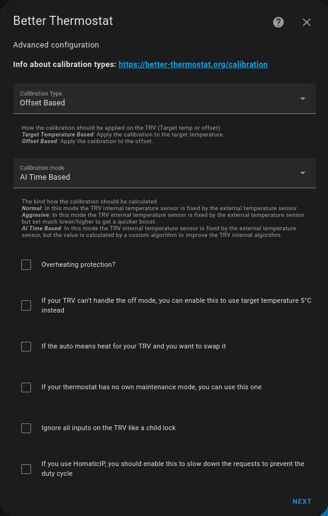

# Create a new Better Thermostat device

** Goto: `Settings` -> `Devices & Services` -> `Integrations` -> `+ Add Integration` -> `Better Thermostat` **

or just click on the button below:

<a href="https://my.home-assistant.io/redirect/config_flow_start/?domain=better_thermostat" target="_blank"></a>


# Configuration

## First step


**Name** This is a required field. It is the name of the virtual climate. It is used to as an entity key name.

**The real thermostat** This is a required field. This is the real climate entity you want to control with BT, if you have more than one climate in your room you can select multiple climate entities, fill out the first field and a second one will appear.

**Temperature sensor** This is a required field. This is the temperature sensor you want to use to control the real climate entity. It's used to get a more accurate temperature reading than the sensor in the real climate entity. Because you can place it in the middle of the room and not close to the radiator.

**Humidity sensor** This is an optional field. For now the humidity is only used to display it in the UI. In the future it will be used make a better calculation of the temperature or set it up to a called feels like temperature.

**If you have an outdoor sensor...** This is an optional field. If you have an outdoor sensor you can use it to get the outdoor temperatures, this is used to set the thermostat on or off, if the threshold (last option in this screen) is reached. It uses a mean of the last 3 days and checks it every morning at 5:00 AM.

**Window Sensor** This is an optional field. If you have a window sensor you can use it to turn of the thermostat if the window is open and turn it on again when the window is closed. If you have more than one window in a room, you can also select window groups (see the GitHub page for more info).

#### Example Window/Door - Sensor config

```yaml
group:
  livingroom_windows:
    name: Livingroom Windows
    icon: mdi:window-open-variant
    all: false
    entities:
      - binary_sensor.openclose_1
      - binary_sensor.openclose_2
      - binary_sensor.openclose_3
```

**Your weather entity for outdoor temperature** This is an optional field. It should be empty if you have an outdoor sensor. This is the weather entity you want to use to get the outdoor temperature. It uses the mean of the last 3 days and checks it every morning at 5:00 AM.

**Window delay** This is an optional field. If you didn't want to turn of the thermostat instantly when the window is open, you can set a delay. This goes in both directions, so if you want to turn it on again after the window is closed, you can set a delay here too.

**The outdoor temperature threshold** This is an optional field. If you have an outdoor sensor or a weather entity, you can set a threshold. If the outdoor temperature is higher than the threshold, the thermostat will be turned off. If the outdoor temperature is lower than the threshold, the thermostat will be turned on. If you don't have an outdoor sensor or a weather entity, this field will be ignored.

## Second step



**Calibration Type** This is a required field. How the calibration should be applied on the TRV (Target temp or offset)

- ***Target Temperature Based***: Apply the calibration to the target temperature.

- ***Offset Based***: Apply the calibration to the offset. This will not be an option if your TRV doesn't support offest mode.


**Calibration Mode**  This is a required field. It determines how the calibration should be calculated

- ***Normal***: In this mode the TRV internal temperature sensor is fixed by the external temperature sensor.

- ***Aggresive***: In this mode the TRV internal temperature sensor is fixed by the external temperature sensor but set much lower/higher to get a quicker boost.

- ***AI Time Based***: In this mode the TRV internal temperature sensor is fixed by the external temperature sensor, but the value is calculated by a custom algorithm to improve the TRVs internal algorithm.


**Overheating protection** This should only be checked if you have any problems with strong overheating.

**If your TRV can't handle the off mode, you can enable this to use target temp 5° instead** If your TRV model doesn't have an off mode, BT will use the min target temp of this device instead, this option is only needed if you have problems, known models that don't have an off mode are auto-detected by BT.

**If auto means heat for your TRV and you want to swap it** Some climates in HA used the mode auto for default heating, and a boost when mode is heat. This isn't what we want, so if this is the case for you, check this option.

**Ignore all inputs on the TRV like a child lock** If this option is enabled, all changes on the real TRV, even over HA, will be ignored or reverted, only input on the BT entity are accepted.

**If you use HomematicIP you should enable this...** If your entity is a HomematicIP entity this option should be enabled, to prevent a duty cycle overload
